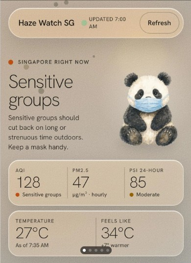

Source: [Reddit discussion about a Singapore haze-monitoring app](https://www.reddit.com/r/ChillSG/s/FQQHcjYerr)

Source community: `r/ChillSG`

A recent Reddit discussion about a Singapore haze-monitoring app caught my attention. It provides a small but useful example of how people are starting to react to vibe-coded software, which are applications built quickly with the help of generative AI and coding agents.

{fig-align="center" width="80%"}

Some commenters appreciated the app and did not seem to care whether AI had been used to build it. Others were much more critical. Terms such as “AI slop” appeared, alongside criticism of design and implementation choices that felt generic, unnecessary, or insufficiently refined.

What I found interesting is that the criticism was not simply “AI wrote this, therefore it is bad.” Some commenters were perfectly happy to use an AI-built application if it was useful.

The negative reactions seemed to be directed more at what people associated with low-effort AI-generated software: generic design choices, unnecessary interface elements, limited differentiation, or features that did not feel fully thought through. The problem was less about how the code was produced and more about whether enough judgment and refinement had been applied before the product was released.

This is where vibe coding creates an interesting tension. AI can dramatically reduce the effort required to turn an idea into working software. That is mostly a good thing. More people can experiment, build prototypes, and turn ideas into something others can actually use.

But reducing implementation effort does not reduce the need for product, design, or engineering judgment. It actually makes these forms of judgment more important.

A working application is only one part of a good product. Someone still needs to ask: Does this solve a real problem? Is the interface appropriate? Are these features actually necessary? Has it been tested properly? Is it secure? Can users trust the data and the application?

In traditional software development, implementation cost created a natural barrier. Building even a relatively small application took enough time and effort that teams had to think carefully about what was worth building. Vibe coding lowers that barrier considerably.

Writing the code may become easier. Deciding what deserves to be built, and engineering it until it deserves to be used, does not.

This discussion also made me think about a distinction I have been trying to make clearer in my own teaching.

When I teach AI-Augmented SDLC, I am not really teaching students how to get an AI coding agent to produce more code. I am interested in what happens when AI becomes part of a software engineering process: requirements still need to express intent, architectural decisions still need reasoning, generated code still needs testing and review, and someone still needs to take responsibility for the resulting system.

The same distinction becomes even more visible in my Deploying Safe and Secure AI Agents course. Once an AI system can use tools, access data, or take actions, getting the agent to work is only the beginning. We also have to decide what it should be allowed to do, validate its actions, restrict permissions, test failure cases, and observe its behaviour. A prompt cannot carry all of that responsibility; the surrounding software has to enforce it.

Vibe coding can be extremely useful for experimentation and prototyping. The problem comes when “it works” is treated as the end of software development rather than the beginning of engineering it properly.

As AI-generated applications become commonplace, I suspect users will care less about whether a human or an AI wrote the code. They will judge what they can actually experience: usefulness, quality, refinement, reliability, and trustworthiness.

Perhaps that is the real lesson from this small Reddit discussion. AI can make it much easier to build working software, but it does not make good software automatically. Getting something to work is becoming easier. Knowing what is worth building, and taking the time to engineer it well, still matters.
