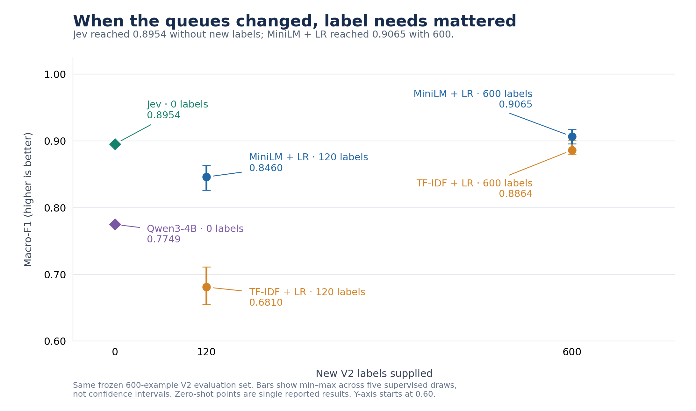

Recently, I came across [Jev](https://docs.typesafe.ai/introduction), a model from TypeSafe. You give it a message and a list of options, and it picks one option and tells you how sure it is.

That sounded like a classifier, which assigns an input, such as a customer request, to one of a fixed set of categories. My first reaction was: do we really need another one? Traditional machine learning (ML) already does classification well.

The interesting part turned out to be what happens **when the business changes the categories**.

## Same message, different destination

Imagine a bank that sends each customer request to a **queue**: the team or workflow responsible for it. Its first setup, which I'll call **V1**, has seven queues. The bank then reorganises. It separates everyday service from security incidents and identity checks, and groups payment problems together. The new setup, **V2**, has nine queues.

| V1 queue          | Goes to in V2                                                                 | What changed                    |
| ----------------- | ----------------------------------------------------------------------------- | ------------------------------- |
| `CARD_SERVICES`   | `CARD_MANAGEMENT`, plus some to `DIGITAL_PAYMENTS` and `SECURITY_DISPUTES`    | Split three ways                |
| `CARD_PAYMENTS`   | `DIGITAL_PAYMENTS`, plus unrecognised payments to `SECURITY_DISPUTES`         | Renamed and split               |
| `CASH_WITHDRAWAL` | `CASH_WITHDRAWAL`, but unrecognised withdrawals go to `SECURITY_DISPUTES`     | Same name, narrower job         |
| `ACCOUNT_ACCESS`  | `ACCOUNT_SERVICES`, `IDENTITY_COMPLIANCE`, plus lost phones to `SECURITY_DISPUTES` | Split three ways          |
| `TRANSFERS`       | `TRANSFERS`                                                                   | Unchanged                       |
| `TOP_UPS`         | `TOP_UPS`                                                                     | Unchanged                       |
| `CURRENCY`        | `CURRENCY`                                                                    | Unchanged                       |

Two queues are new in V2: `IDENTITY_COMPLIANCE` (verifying identity and where funds come from) and `SECURITY_DISPUTES` (unrecognised transactions, suspected compromise, and lost or stolen cards or phones).

Take the request "I don't recognise this ATM withdrawal". In V1 it goes to `CASH_WITHDRAWAL`. In V2 it goes to `SECURITY_DISPUTES`, because it needs a security investigation. An ATM that fails to dispense cash still goes to `CASH_WITHDRAWAL`.

The message hasn't changed. **The correct destination has.**

## How I tested it

I used [PolyAI's BANKING77 dataset from Hugging Face](https://huggingface.co/datasets/PolyAI/banking77): 13,083 banking customer queries, each tagged with one of 77 detailed intents, split into 10,003 training and 3,080 test examples. I mapped each intent to a V1 queue and a V2 queue.

From the 3,080 test examples, I drew a fixed evaluation set of 600 requests, with at least 40 for every V2 queue so that small queues could still be measured. Every model, in both tests, was scored on these same 600 requests.

Models only ever saw the customer's text. The original intents and the correct queues stayed with the evaluation script.

I compared two ways of choosing a queue: **learning from labelled examples** (requests with their correct queue recorded) and **reading queue descriptions**.

Learning from labelled examples:

- **TF-IDF + Logistic Regression (LR):** TF-IDF scores each word by how distinctive it is, so "ATM" and "withdrawal" carry more weight than "my" or "the". LR then learns which word patterns go with which queue. Despite its name, LR assigns categories here.
- **MiniLM + LR:** MiniLM turns each request into a list of numbers that captures its meaning, called an *embedding*. That helps it see that "my transfer hasn't arrived" and "the recipient hasn't received the money" are similar. LR then learns queues from the embeddings.

Reading queue descriptions:

- **Qwen3-4B:** a small, general-purpose language model, asked to pick a queue from the descriptions.
- **Jev:** a model built specifically to choose between defined options, given the same descriptions.

I report three measures:

- **Accuracy:** the percentage of requests sent to the right queue.
- **Macro-F1:** a score that weights every queue equally, so a model can't do well by getting only the big queues right. It penalises both requests sent to the wrong queue and requests a queue missed. I show it out of 100; 100 is perfect.
- **p50 latency:** the median response time. Half the decisions finish faster than this, half slower.

## Test 1: ordinary ML was already strong

Both models that learn from labelled examples were trained on all 10,003 training requests, using V1 queues.

| Model       | Macro-F1 | Accuracy | p50 latency |
| ----------- | -------- | -------- | ----------- |
| TF-IDF + LR | 95.9     | 96.0%    | 0.37 ms     |
| MiniLM + LR | 95.1     | 95.7%    | 13 ms       |

TF-IDF + LR was slightly more accurate and about 36 times faster. Distinctive banking words probably helped it.

It was a useful reminder: a newer model needs to earn its place.

## Test 2: change the queues

Now switch to V2. For the trained models, the question is how much of the old training data can be reused.

**Reused:** `TRANSFERS`, `TOP_UPS` and `CURRENCY` didn't change, so their 3,930 historical examples still point to the right V2 queue.

**Not reused:** the other six V2 queues are affected by the reorganisation:

- `CARD_MANAGEMENT`, `DIGITAL_PAYMENTS` and `ACCOUNT_SERVICES` took over parts of old queues that were split.
- `IDENTITY_COMPLIANCE` and `SECURITY_DISPUTES` are new.
- `CASH_WITHDRAWAL` kept its name but lost unrecognised withdrawals to security.

An old label such as `CARD_SERVICES` no longer tells you which V2 queue a request belongs to, so I didn't use those historical labels.

Instead, I gave the trained models newly labelled requests for these six queues: either 20 or 100 per queue, which is 120 or 600 in total. Results depend on which requests happen to be picked, so I repeated each condition with five different random samples and report the average.

Qwen and Jev received the V2 queue descriptions and **no labelled V2 examples at all**, a setup called *zero-shot*. Neither was retrained.

| Method      | New V2 labels | Macro-F1 | Range across five samples |
| ----------- | ------------- | -------- | ------------------------- |
| Qwen3-4B    | 0             | 77.5     | -                         |
| Jev         | 0             | 89.5     | -                         |
| TF-IDF + LR | 120           | 68.1     | 65.5-71.1                 |
| MiniLM + LR | 120           | 84.6     | 82.6-86.3                 |
| TF-IDF + LR | 600           | 88.6     | 87.9-90.0                 |
| MiniLM + LR | 600           | 90.7     | 89.6-91.7                 |

*V2 Macro-F1 against the number of newly labelled examples (the chart uses a 0-1 scale). Jev scores 0.895 with no new labels; MiniLM + LR scores 0.907 with 600. Vertical bars show the lowest and highest result across five samples.*

Three things stand out.

**With few labels, MiniLM + LR adapted much better than TF-IDF + LR.** At 120 labels it scored 16.5 points higher. At 600 labels, the gap shrank to 2 points. MiniLM's built-in knowledge of language seems to matter most when examples are scarce.

**Jev came close without any new labels.** It scored 89.5, just 1.1 points below MiniLM + LR trained on 600 new labels. A gap this small doesn't prove the two are equivalent, but it makes Jev worth a closer look.

**Qwen flooded the security queue.** The test set contains 47 security requests. Qwen sent 100 requests to `SECURITY_DISPUTES`, and only 43 of them belonged there. In a real bank, the security team would spend most of its time on false alarms. Jev sent 42 requests to security, and 40 of them belonged there.

## Fast decisions, or fast adaptation?

| Method      | Test | Where it ran          | p50 latency |
| ----------- | ---- | --------------------- | ----------- |
| TF-IDF + LR | V1   | My laptop             | 0.37 ms     |
| MiniLM + LR | V1   | My laptop             | 13 ms       |
| Jev         | V2   | TypeSafe's online API | 685 ms      |
| Qwen3-4B    | V2   | My laptop             | 1.2 s       |

*These setups differ, so treat the table as a rough guide to scale, not a like-for-like comparison. The API time includes the network round trip.*

Jev cost about $0.014 for all 600 requests, roughly $0.02 per 1,000 decisions, not counting other operating costs.

The trained models were much faster per decision. Jev's advantage was different: I could test the new queues without first collecting new labels. I didn't measure the total time it takes to adapt, though. New queue descriptions still need testing before they go live.

## Confidence needs checking too

On average, Jev said it was 94.4% sure of its choice. It was right 89.0% of the time. So it was somewhat overconfident.

Its confidence was still useful for choosing what to review. I sorted requests from least to most confident and checked how many errors were among the least confident:

| Least-confident requests reviewed | Requests | Share of all errors found |
| --------------------------------- | -------- | ------------------------- |
| 10%                               | 60       | 36%                       |
| 20%                               | 120      | 59%                       |
| 30%                               | 180      | 73%                       |

Reviewing the least-confident fifth of requests would have caught nearly three-fifths of the errors. I calculated this after the experiment; I didn't test whether human reviewers would actually fix them.

The broader point: **the model proposes a decision, and the surrounding software decides what happens next**, whether to act on it, hold it for review, or ask for more information.

## What I would take into a real project

| Your situation                                                | What to try first                                                                                      |
| ------------------------------------------------------------- | ------------------------------------------------------------------------------------------------------ |
| Queues rarely change; plenty of labelled requests             | TF-IDF + LR. Accurate and very fast here.                                                              |
| Queues just changed; you can label a small number of requests | MiniLM + LR. It needed far fewer labels than TF-IDF + LR.                                              |
| New queues, no labelled requests yet                          | Jev, with a description of each queue. Compare its choices against people reviewing the same requests. |
| Requests can't leave your organisation                        | A model you can run on your own systems. Test its accuracy and speed on your own requests.             |

I would also record **what the customer needs** separately from **which queue handles it**. In my experiment, the historical data recorded only the old queue, so a reorganisation meant relabelling. If each request also recorded the need, such as "unrecognised withdrawal", a reorganisation could often be handled by updating a lookup table from needs to queues.

These findings come from one simulated reorganisation, 600 test requests and one configuration of one small language model. Real tickets are messier, and the models may have seen this public dataset during training.

::: {.callout-note collapse="true"}
## Additional experiment details

MiniLM used `all-MiniLM-L6-v2` (384-dimensional embeddings). Qwen used `Qwen3-4B-Instruct-2507`, Q4_K_M quantisation through Ollama. Jev was requested as `jev-latest`; the API reported the serving model as `jev-1.13.0`. For V2, Logistic Regression used balanced class weights to account for unequal amounts of reusable historical data and newly labelled data. The 20-label samples were nested inside the corresponding 100-label samples. Zero-shot means no task examples were supplied for V2; both models still used pretrained knowledge and the queue descriptions.

The 600-request evaluation set was allocated by V2 queue as follows: `CARD_MANAGEMENT` 135, `TOP_UPS` 91, `TRANSFERS` 83, `DIGITAL_PAYMENTS` 78, `SECURITY_DISPUTES` 47, `CURRENCY` 46, and 40 each for `CASH_WITHDRAWAL`, `ACCOUNT_SERVICES` and `IDENTITY_COMPLIANCE`.

Full-precision results:

| Model / condition      | Macro-F1 | Accuracy | p50 latency |
| ---------------------- | -------- | -------- | ----------- |
| TF-IDF + LR, V1        | 0.9588   | 0.9600   | 0.370 ms    |
| MiniLM + LR, V1        | 0.9508   | 0.9567   | 13.338 ms   |
| Qwen3-4B, V2 zero-shot | 0.7749   | 0.7767   | 1,214.45 ms |
| Jev, V2 zero-shot      | 0.8954   | 0.8900   | 684.89 ms   |

Security-queue results (47 security requests in the evaluation set):

| Model    | Precision | Recall | F1     |
| -------- | --------- | ------ | ------ |
| Qwen3-4B | 0.4300    | 0.9149 | 0.5850 |
| Jev      | 0.9524    | 0.8511 | 0.8989 |

Precision is the share of requests sent to security that belonged there; recall is the share of real security requests that reached security.

Jev's 600 requests cost $0.013691 and consumed 325,972 input tokens. Its Expected Calibration Error was 5.85%: this summarises the gap between reported probability and observed correctness across probability bins. Among 499 predictions with probability between 0.9 and 1.0, mean probability was 98.87% and accuracy was 93.99%. Its [confidence score is derived from the probability distribution](https://docs.typesafe.ai/confidence), so it is not independent evidence of correctness. Review thresholds need fresh validation on the intended workload.
:::

You can find the experiment source code on [GitHub](https://github.com/pengbin2015/jev-experiment/tree/main).
