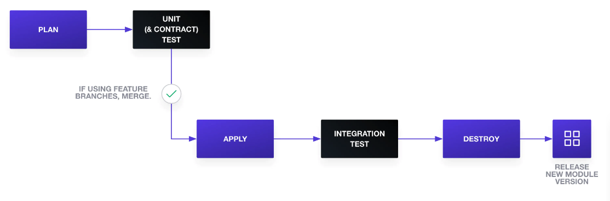
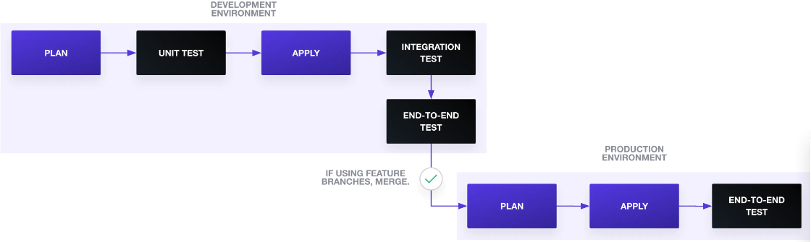

# Introduction

Running tests against infrastructure is difficult because tests can't be executed on a developer's local machine, requiring access to real Cloud platforms. This limitation leads to several issues: longer testing times, delayed error detection, increased testing costs, and the need for significant setup efforts in the Cloud environment.

And we'll discuss testing strategies aligned with the test pyramid concept, emphasizing unit tests and exploring ways to apply this strategy effectively to Terraform testing.

# Unit Test

You can use `terraform fmt -check` and `terraform validate` to perform rudimentary unit tests. Additionally, leverage tools like HashiCorp Sentinel or Open Policy Agent to write unit tests that check parameters and security policies in Terraform configuration plans. To generate a Terraform configuration plan, use the following command to save it to a file::

```
terraform plan -out=tfplan
```

You can also use Terratest or kitchen-terraform frameworks to write unit tests.

# Contract Test

Contract test ensures that the contract between a Terrorm configuration's expected inputs to a module and the module's actual inputs has not been broken. You can consider contract test as one special unit test for Terraform.

First, you can use custom validation rules for contract tests. For example, employ a custom validation rule to ensure that an AWS load balancer’s listener rule receives a valid integer range for its priority.

```
variable "listener_rule_priority" {
 type        = number
 default     = 1
 description = "Priority of listener rule between 1 to 50000"
 validation {
   condition     = var.listener_rule_priority > 0 && var.listener_rule_priority < 50000
   error_message = "The priority of listener_rule must be between 1 to 50000."
 }
}
```

Second, validate variables with an object structure and confirm that the module receives the expected input. In the AWS load balancer case, add a map representing service objects and their expected attributes and type.

```
variable "services" {
 description = "Consul services monitored by Consul-Terraform-Sync"
 type = map(
   object({
     id        = string
     name      = string
     address   = string
     port      = number
     kind      = string
     meta      = map(string)
     tags      = list(string)
     namespace = string
     status    = string

     node                  = string
     node_id               = string
     node_address          = string
     node_datacenter       = string
     node_tagged_addresses = map(string)
     node_meta             = map(string)
   })
 )
}
```

# Integration Test

Integration testing can be achieved by running `terraform apply` in the staging environment. Alternatively, you can use frameworks like Terratest or kitchen-terraform for writing comprehensive integration tests.

HashiCorp now provides an [the module integration testing experiment](https://developer.hashicorp.com/terraform/language/modules/testing-experiment).

# End-toEnd Tests

Frameworks like Terratest and kitchen-terraform can also be employed for end-to-end testing scenarios.

# Testing Terraform Modules

When creating and testing new Terraform modules, consider running a module delivery pipeline that begins with a `terraform plan`. Subsequently, execute unit tests (including contract tests) to validate the module's inputs. Follow this with `terraform apply` and ntegration tests to thoroughly check the module. After running integration tests, remove the resources and release a new module version.



# Testing Terraform Configuration

For Terraform configuration testing, unit tests should focus on configuration aspects not associated with modules. Integration tests can verify that changes successfully run in a long-lived development environment. Additionally, include end-to-end tests to confirm end-user functionality. After successful tests in the development environment, apply the changes to the production environment, followed by end-to-end tests to ensure system availability.



# Conclusion

Your Terraform testing strategy doesn't need to be a perfect test pyramid. Adapt these testing practices to suit your project's requirements. Explore [a list of infrastructure testing tools](https://github.com/joatmon08/tdd-infrastructure) for further assistance in enhancing your Terraform testing efforts.
